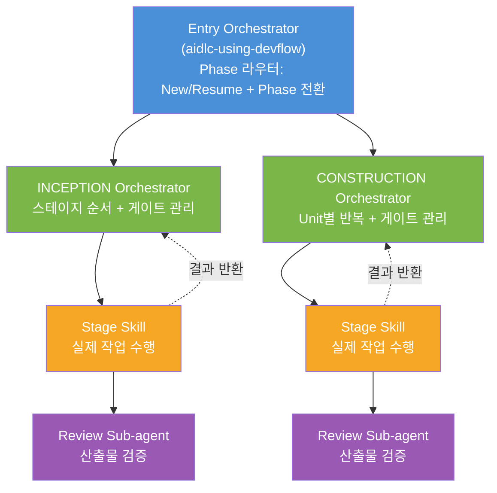
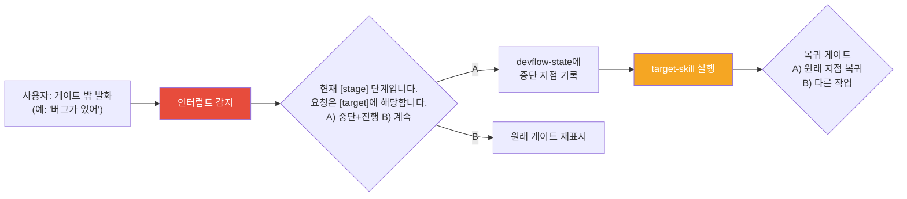
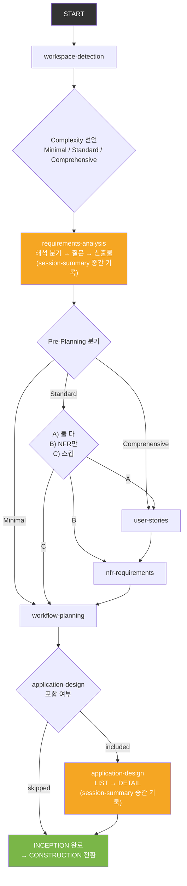
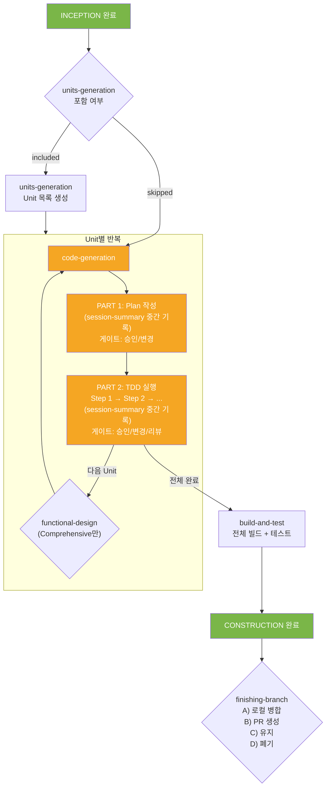
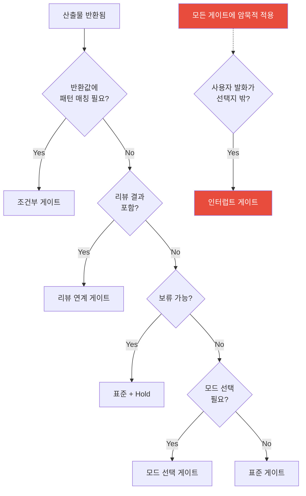
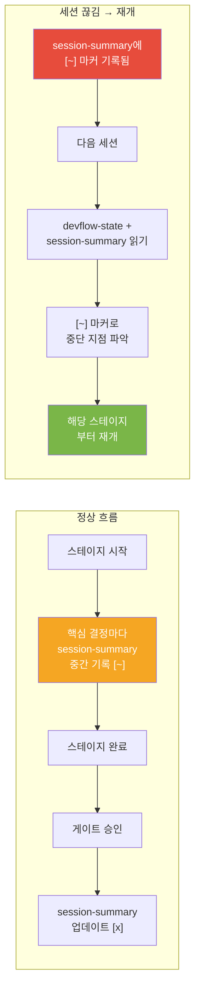
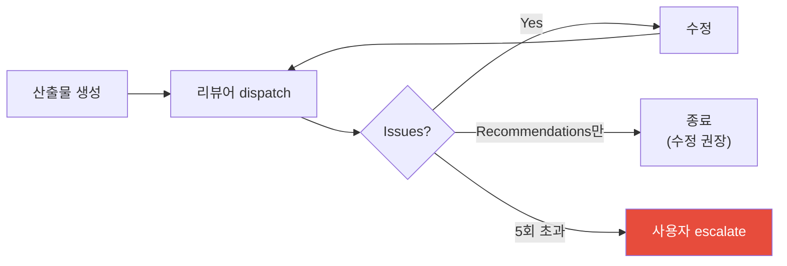
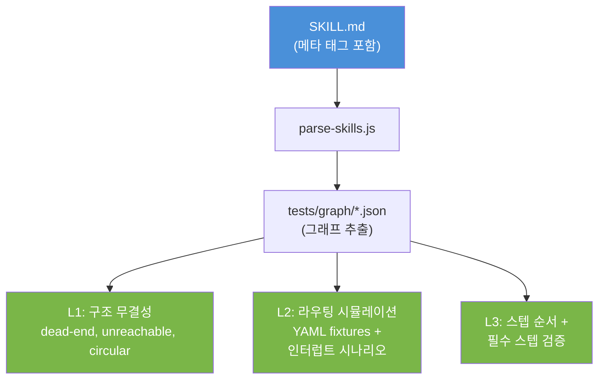

# 아키텍처 문서

aidlc 플러그인의 내부 구조를 설명합니다. 스킬 개발자와 기여자를 위한 기술 참조 문서입니다.

---

## 3단 위임 체인



### 인터럽트 흐름 (어느 게이트에서든 발동)



각 계층은 자기 역할만 하고 빠진다:
- **Entry Orchestrator**: Phase 라우터. New/Resume 판별 + Phase 전환
- **Phase Orchestrator**: 스테이지 순서 + 게이트 관리. 실제 작업 안 함
- **Stage Skill**: 실제 작업 수행 + 리뷰 dispatch
- **Review Sub-agent**: 산출물 검증만

---

## Phase 구조

### INCEPTION 실행 흐름



| 스테이지 | 실행 조건 | 산출물 |
|---------|----------|--------|
| workspace-detection | 항상 | workspace.md |
| requirements-analysis | 항상 | requirements.md |
| user-stories | 조건부 (Pre-Planning) | user-stories.md |
| nfr-requirements | 조건부 (Pre-Planning) | nfr-requirements.md |
| workflow-planning | 항상 | workflow-plan.md |
| application-design | 조건부 (workflow-plan) | application-design.md |

### CONSTRUCTION 실행 흐름



| 스테이지 | 실행 조건 | 산출물 |
|---------|----------|--------|
| functional-design | 조건부 (Comprehensive) | functional-design.md |
| code-generation | 항상 (Plan → Generate) | code-plan.md + 소스 코드 |
| build-and-test | 항상 | 빌드/테스트 결과 |

---

## 게이트 패턴

오케스트레이터가 사용하는 게이트 유형 (`_shared/gate-patterns.md`):



| 패턴 | 선택지 | 사용처 |
|------|--------|--------|
| **표준 게이트** | A) 변경 / B) 승인 | 대부분의 스테이지 |
| **조건부 게이트** | 반환값에 따라 분기 | requirements-analysis (열린 질문 유무) |
| **리뷰 연계 게이트** | A) 수정 / B) 승인 / R) 리뷰 | application-design DETAIL |
| **표준 + Hold** | A) 변경 / B) 승인 / H) 보류 | Pre-Planning 스테이지 |
| **모드 선택** | A) 모드A / B) 모드B / S) 스킵 | nfr-requirements |
| **인터럽트 게이트** | A) 중단+라우팅 / B) 계속 | 모든 게이트에 암묵적 적용 |

### 인터럽트 게이트 의도 분류

사용자 발화가 게이트 선택지 밖일 때, 아래 테이블로 의도를 분류한다:

| 의도 신호 | 라우팅 대상 |
|----------|-----------|
| 버그, 에러, 실패 | systematic-debugging |
| 계획 수정, plan 변경 | writing-plans |
| 설계 재검토, 방향 변경 | brainstorming |
| 테스트 작성, TDD | test-driven-development |
| 브랜치 정리, PR, 머지 | finishing-a-development-branch |
| 매칭 실패 | 사용자에게 의도 확인 질문 |

상세: `_shared/patterns/interrupt-handler.md`

---

## 세션 연속성



### session-summary 업데이트 타이밍

| 시점 | 트리거 | 기록 내용 |
|------|--------|----------|
| 스테이지 내부 핵심 결정 | Stage Skill | `[~] stage — 진행 상황` (조기 업데이트) |
| 스테이지 완료 | Phase Orchestrator 게이트 승인 | `[x] stage — 결과 요약` |
| Phase 전환 | Entry Orchestrator | Phase 변경 + 커밋 해시 |

### 스킬별 중간 기록 시점

| 스킬 | 중간 기록 시점 |
|------|--------------|
| requirements-analysis | 해석 분기 확정 후, 핵심 질문 답변 후 |
| application-design | LIST 완료 후, DETAIL 컴포넌트 완료마다 |
| code-generation | Plan 승인 후, TDD Step 완료마다 |

---

## Instruction Priority

충돌 시 우선순위:

1. **사용자 지시** (CLAUDE.md, 직접 요청) — 최우선
2. **스킬 규칙** (SKILL.md, `_shared/` 규약)
3. **기본 동작** (시스템 프롬프트) — 최하위

---

## 리뷰 체계

### 리뷰 루프



### 리뷰어 프롬프트

| 프롬프트 | 용도 | 사용 스킬 |
|---------|------|----------|
| `spec-document-reviewer-prompt.md` | 설계 문서 | brainstorming |
| `plan-document-reviewer-prompt.md` | 구현 계획 | writing-plans |
| `artifact-reviewer-prompt.md` | INCEPTION 산출물 | application-design 게이트 |
| `spec-reviewer-prompt.md` | Spec compliance | requesting-code-review Stage 1 |
| `code-quality-reviewer-prompt.md` | 코드 품질 + OWASP | requesting-code-review Stage 2 |
| `code-reviewer-prompt.md` | Spec + Quality 통합 | construction-orchestrator |
| `code-plan-reviewer-prompt.md` | 코드 계획 | code-generation PART 1 |
| `skill-reviewer-prompt.md` | 스킬 검증 | writing-skills REFACTOR |

### Depth 정책

- **Minimal**: 리뷰 스킵
- **Standard/Comprehensive**: 리뷰 자동 실행
- fallback 우선순위: 호출 텍스트 → workflow-plan Stage Depths → devflow-state Complexity

---

## 스킬 개발 검증

writing-skills의 REFACTOR 단계 완료 후:

```
  skill-reviewer Approved
     |
     v
  최적화 게이트:
  A) 스킬 완성 — description 수동 검증으로 충분
  B) 정량적 최적화 — skill-creator로 eval + description 최적화

  (skill-creator 미설치 시 A만 표시)
```

상세: `skills/aidlc-writing-skills/SKILL.md` REFACTOR 단계

---

## 공유 패턴 (`_shared/patterns/`)

| 파일 | 용도 |
|------|------|
| `three-mode-selection.md` | Together/Import/Skip 모드 |
| `hold-mechanism.md` | 보류(Hold) 상태 관리 |
| `brownfield-exploration.md` | 기존 코드베이스 탐색 |
| `session-continuity.md` | 세션 재개 프로토콜 + 조기 업데이트 규약 |
| `interrupt-handler.md` | 인터럽트 의도 분류 + 라우팅 + 복귀 프로토콜 |
| `skill-writing-guide.md` | 스킬 작성 원칙 + TDD 방법론 |
| `skill-design-patterns.md` | 구조 패턴 5종 (Tool Wrapper, Generator 등) |
| `persuasion-principles.md` | 규율 강제 언어 설계 |
| `skill-pattern-catalog.md` | 행동 패턴 7종 |
| `question-format-guide.md` | 질문 설계 원칙 |
| `tech-stack-defaults.md` | 기술 스택 인덱스 (프리셋 + 정책) |
| `tech-stack-catalog.md` | 기술 카탈로그 |
| `meta-tag-standard.md` | 메타 태그 규격 + 유지보수 |

---

## 메타 태그 시스템

오케스트레이터 SKILL.md에 HTML 주석 형태의 메타 태그가 삽입되어 있다.
이를 통해 **LLM 토큰 0으로** 분기/라우팅/스텝 순서를 정적 검증할 수 있다.

### 태그 타입

| 태그 | 용도 | 예시 |
|------|------|------|
| `@gate` | 분기점 선언 | `<!-- @gate: complexity-declaration -->` |
| `@gate-option` | 선택지 정의 | `<!-- @gate-option: A -> requirements-analysis -->` |
| `@step` | 실행 단계 순서 | `<!-- @step:1 id=workspace-detection -->` |
| `@condition` | 자동 분기 조건 | `<!-- @condition: complexity==Minimal -> workflow-planning -->` |
| `@interrupt` | 인터럽트 핸들러 | `<!-- @interrupt: global -->` |

### 검증 파이프라인



### 현재 적용 범위

- `aidlc-inception-orchestrator` — 8 steps, 11 gates, 5 conditions
- `aidlc-construction-orchestrator` — 3 steps, 5 gates, 1 interrupt

규격 상세: `_shared/patterns/meta-tag-standard.md`

---

## 스킬 패턴 7종

| 패턴 | 핵심 | 대표 스킬 |
|------|------|----------|
| **Iron Law** | "NO X WITHOUT Y" 강제 | test-driven-development |
| **Gate** | N지선다 분기 | finishing-a-development-branch |
| **Review Loop** | 산출물 → 리뷰 → 수정 반복 | code-generation |
| **Three-Mode** | Minimal/Standard/Comprehensive | requirements-analysis |
| **Hold/Skip** | Import/Generate + 보류 | nfr-requirements |
| **Orchestrator-Only** | 순수 실행자 | workspace-detection |
| **User-Invocable** | standalone + orchestrator 양용 | brainstorming |

상세: `_shared/patterns/skill-pattern-catalog.md`
외부 공개 가이드: `docs/guide/skill-design-patterns/`

---

## 서브에이전트 컨텍스트 격리

- 세션 히스토리 전달 금지 — 태스크에 필요한 최소 컨텍스트만 구성
- 필수: 태스크 명세, 파일 경로, 기술 제약, 산출물 형식
- 금지: 이전 대화, 다른 태스크 결과, 사용자 피드백 원문

---

## 디렉토리 구조

```
skills/
├── aidlc-using-devflow/           <- Entry Orchestrator
├── aidlc-inception-orchestrator/  <- Phase Orchestrator
├── aidlc-construction-orchestrator/
├── aidlc-*/                       <- Stage Skills (20+)
├── _shared/
|   ├── devflow-conventions.md     <- 전체 규약
|   ├── gate-patterns.md           <- 게이트 패턴 (인터럽트 포함)
|   ├── tdd-protocol.md            <- TDD 규약
|   ├── import-review-protocol.md  <- Import/Generate 프로토콜
|   ├── patterns/                  <- 공유 패턴 (12개)
|   └── reviewers/                 <- 리뷰어 프롬프트 (8개)
├── _utils/
|   ├── devflow-audit/             <- 감사 로그
|   └── devflow-state/             <- 상태 관리
hooks/
├── hooks.json                     <- SessionStart 이벤트
└── session-start                  <- 안내 메시지 출력
tests/
├── validate-skills.sh             <- 구조 검증 스크립트
├── run-all.sh                     <- 전체 테스트 러너
├── parse-skills.js                <- 메타 태그 파서
├── conftest.py                    <- pytest 공유 fixtures
├── routing_engine.py              <- 라우팅 시뮬레이션 엔진
├── graph/                         <- 파서 출력 JSON
├── scenarios/                     <- L2 시뮬레이션 YAML (인터럽트 시나리오 포함)
├── test_meta_tag_format.py        <- 태그 형식 검증
├── test_parser_output.py          <- 파서 출력 검증
├── test_graph_validator.py        <- L1 정적 그래프 검증
├── test_routing_simulator.py      <- L2 라우팅 시뮬레이션
├── test_routing_engine.py         <- 엔진 단위 테스트
└── test_step_order.py             <- L3 스텝 순서 검증
docs/
├── guide/                         <- 가이드 문서
|   └── skill-design-patterns/     <- 스킬 설계 패턴 외부 공개 가이드
└── research/                      <- 리서치 문서
```
