# 아키텍처 문서 v2

aidlc 플러그인 v1.12.0의 내부 구조. 스킬 개발자/기여자/하네스 빌더를 위한 기술 참조.

> **변경 이력**: v1 → v2 (2026-05-07). v1 대비 추가/갱신된 핵심 — Auto Mode, Knowledge System Phase 1 (6-type + L1 ingest hook), Brownfield Stub 가드, 외부 분리 패턴(BL-105), 게이트 3등급 분류, Handoff=Hypothesis 원칙, mid-cycle pause 2단계 단순화. 이전 버전은 [architecture_v1.md](architecture_v1.md).

---

## 0. 한눈에 보는 시스템 (Top-Level)

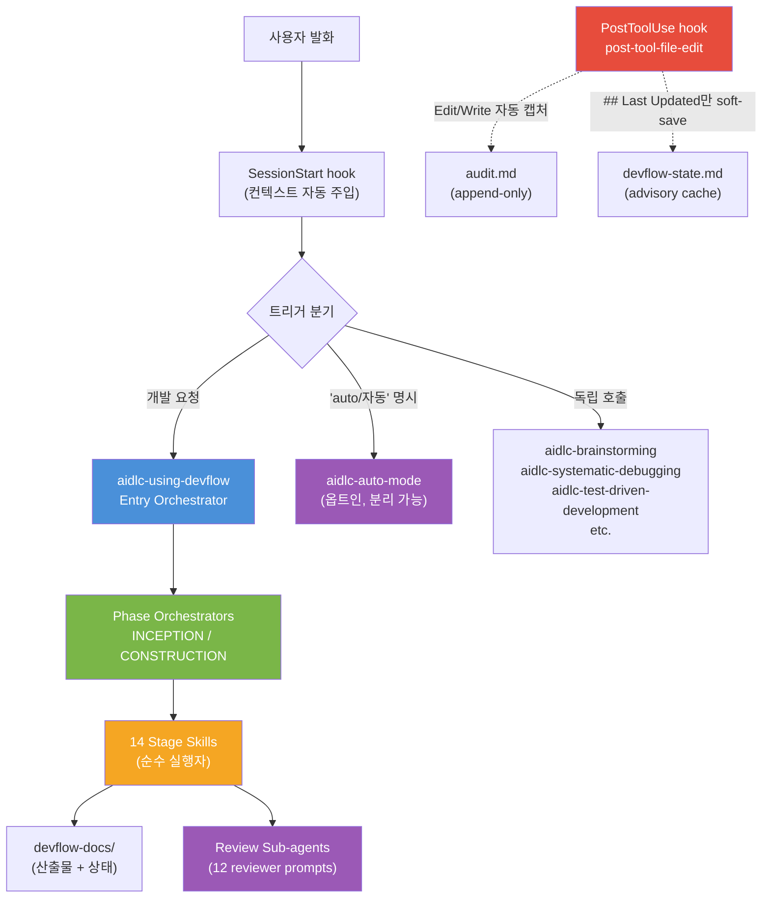

**규모 (v1.12.0)**:
- 28 skills + 3 utilities (`devflow-state` / `devflow-audit` / `devflow-solutions`)
- 12 reviewer prompts + 17 shared patterns + 4 shared protocols
- 2 hooks (SessionStart, PostToolUse) + 273 정적 테스트 (L1/L2/L3)

---

## 1. 3단 위임 체인 (Three-Layer Delegation)

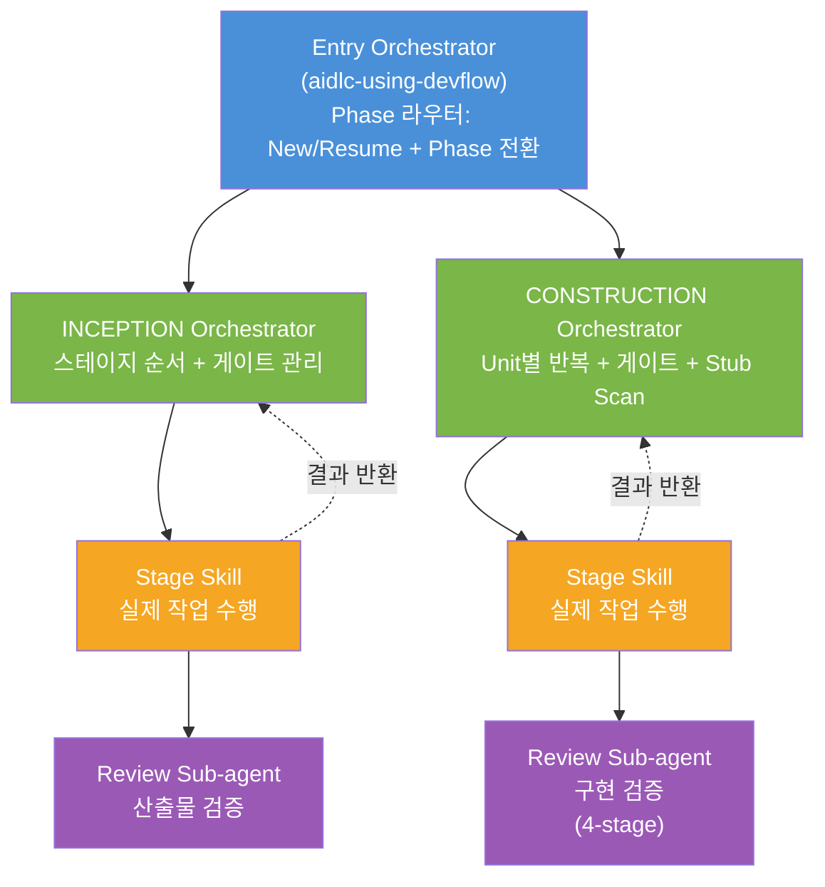

각 계층은 자기 역할만 하고 빠진다:

| 계층 | 책임 | 책임이 아닌 것 |
|------|------|--------------|
| **Entry Orchestrator** | Phase 라우터, New/Resume 판별, Phase 전환 | 스테이지 실행, 게이트 제시 |
| **Phase Orchestrator** | 스테이지 순서 + 게이트 관리 + 라우팅 | 실제 작업 수행 |
| **Stage Skill** | 산출물 생성, 리뷰 dispatch | 게이트 제시(`stop-no-gate`) |
| **Review Sub-agent** | 산출물 검증 결과 반환 | 직접 수정 |

**핵심 원칙**: orchestrator만 게이트를 소유한다. Stage skill은 `return_behavior: stop-no-gate`로 작업 후 즉시 종료한다.

---

## 2. INCEPTION 실행 흐름

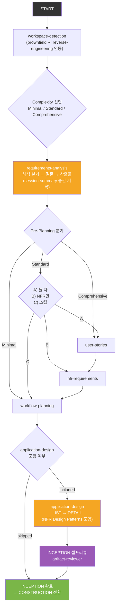

| 스테이지 | 실행 조건 | 산출물 |
|---------|----------|--------|
| workspace-detection | 항상 | `inception/workspace.md` |
| requirements-analysis | 항상 | `inception/requirements.md` |
| user-stories | 조건부 (Pre-Planning) | `inception/user-stories.md` |
| nfr-requirements | 조건부 (Pre-Planning) | `inception/nfr-requirements.md` |
| workflow-planning | 항상 | `inception/workflow-plan.md` |
| application-design | 조건부 (workflow-plan) | `inception/application-design.md` |
| **INCEPTION 셀프리뷰** | application-design 후 | (artifact-reviewer Verdict) |

---

## 3. CONSTRUCTION 실행 흐름

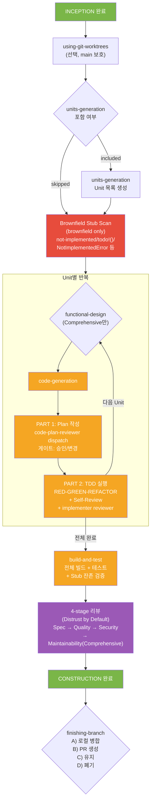

| 스테이지 | 실행 조건 | 산출물 |
|---------|----------|--------|
| using-git-worktrees | 선택 | git worktree 생성 |
| **Stub Scan** | brownfield only | implementer 인라인 컨텍스트 |
| functional-design | Comprehensive | `construction/{unit}/functional-design.md` |
| code-generation | 항상 (Plan→Generate) | `construction/{unit}/code-plan.md` + 소스 |
| build-and-test | 항상 | `construction/build-and-test/*.md` + Stub 잔존 검증 |
| **4-stage 리뷰** | Distrust by Default | (4 reviewer Verdicts) |

### 3.1 Brownfield Stub Blind Spot 가드

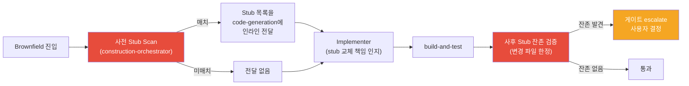

**탐지 패턴**: `not yet implemented`, `todo!()`, `unimplemented!()`, `NotImplementedError`, `UnsupportedOperationException`, `panic("TODO")` 등.

**근거**: SDD + Mock 테스트가 stub을 은폐하는 구조적 맹점. 사전(인지) + 사후(검증) 양면 가드.

---

## 4. 인터럽트 흐름 (어느 게이트에서든 발동)

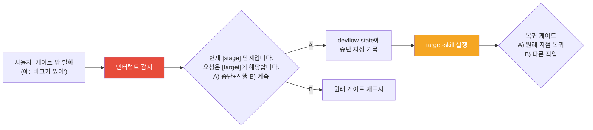

### 4.1 의도 분류 라우팅

| 발화 신호 | 라우팅 대상 |
|----------|-----------|
| 버그, 에러, 실패 | `aidlc-systematic-debugging` |
| 계획 수정, plan 변경 | `aidlc-writing-plans` |
| 설계 재검토, 방향 변경 | `aidlc-brainstorming` |
| 테스트 작성, TDD | `aidlc-test-driven-development` |
| 브랜치 정리, PR, 머지 | `aidlc-finishing-a-development-branch` |
| 매칭 실패 | 사용자에게 의도 확인 질문 |

상세: `_shared/patterns/interrupt-handler.md`

---

## 5. 게이트 3등급 분류 (v1.9.0+)

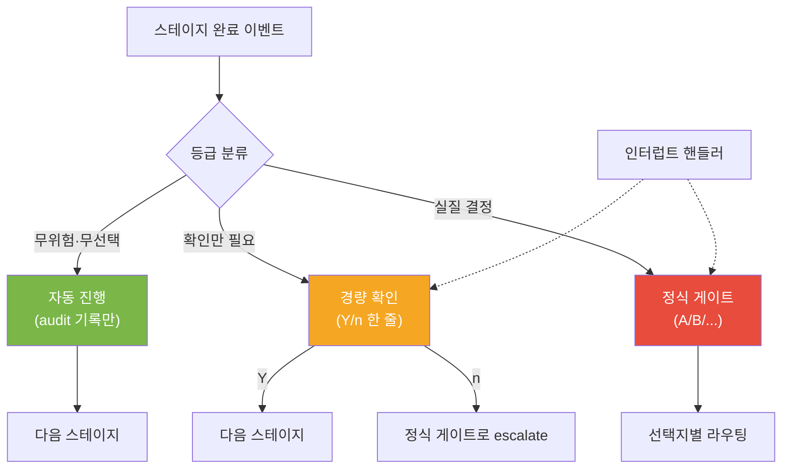

| 등급 | 사용 조건 | 예시 |
|------|----------|------|
| **자동 진행** | 무위험·무선택, audit 기록만 | requirements-analysis (N==0, 가정 없음) |
| **경량 확인** | 확인만 필요, 한 줄 Y/n | tech-stack 프리셋 ("이대로 사용? Y/n") |
| **정식 게이트** | 실질 결정, A/B/.../R/H/S | application-design DETAIL, finishing-branch |

### 5.1 정식 게이트 패턴

| 패턴 | 선택지 | 사용처 |
|------|--------|--------|
| 표준 게이트 | A) 변경 / B) 승인 | 대부분의 스테이지 |
| 조건부 게이트 | 반환값에 따라 분기 | requirements-analysis (열린 질문 유무) |
| 리뷰 연계 게이트 | A) 수정 / B) 승인 / R) 리뷰 | application-design DETAIL |
| 표준 + Hold | A) 변경 / B) 승인 / H) 보류 | Pre-Planning 스테이지 |
| 모드 선택 | A) 모드A / B) 모드B / S) 스킵 | nfr-requirements (GENERATE/IMPORT) |
| 인터럽트 게이트 | A) 중단+라우팅 / B) 계속 | 모든 게이트에 암묵적 적용 |

상세: `_shared/gate-patterns.md`

---

## 6. 세션 연속성 + Handoff = Hypothesis (v1.11+)

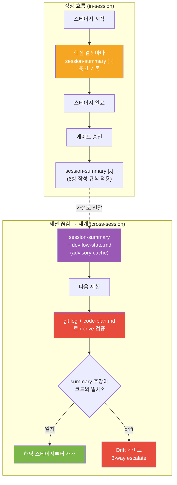

### 6.1 session-summary 6항 작성 규칙 (BL-093)

| # | 규칙 | 근거 |
|---|------|------|
| 1 | Open Work는 **상태 서술형** ("X is not yet implemented"), 명령형 금지 | 다음 세션이 맹목 실행 방지 |
| 2 | 파일 참조는 **라인 번호까지** (`path:L10-L45`) | 검증 대상을 명시 |
| 3 | **"Traps to Avoid"** 섹션 (실패한 접근 명시) | 같은 함정 반복 차단 |
| 4 | **검증 지시** ("이 문서를 코드와 대조해 검증") | Handoff = Hypothesis 명시 |
| 5 | CLAUDE.md 중복 회피 | 토큰 낭비 방지 |
| 6 | **2K 토큰 상한** | Tier 2 handoff 무게 제어 |

### 6.2 Handoff = Hypothesis 원칙 (BL-095)

session-summary의 모든 주장은 **검증 대상 가설**로 전달된다. 다음 세션은:
1. summary를 사실로 신뢰하지 않는다.
2. `git log` + `code-plan.md` + 변경 파일과 대조 검증한다.
3. drift 발견 시 3-way 게이트로 사용자 escalation.

### 6.3 devflow-state.md = Advisory Cache (v1.12.0)

`devflow-state.md`는 `git log` + `code-plan.md`로 derive 가능한 **advisory cache**. 갱신 부담 제거, drift 허용 모델.

- `## Last Updated`만 hook이 soft-save (race condition 회피).
- 구조 섹션(`## Current Phase` 등)은 스킬 전용 쓰기 권한.
- 자연 발화 시에만 갱신 (mid-cycle pause 2단계 자동화).

상세: `_shared/patterns/session-continuity.md`, `skills/aidlc-auto-mode/session-resume-protocol.md`

---

## 7. 리뷰 체계 (Distrust by Default)

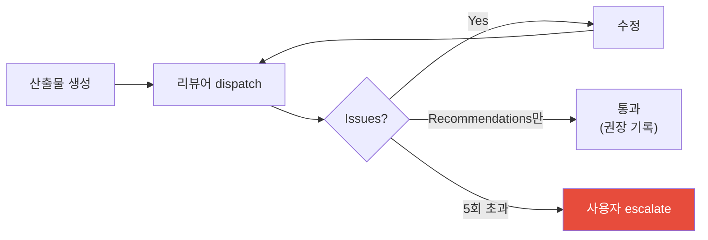

### 7.1 4-stage 코드 리뷰 (관점 커버리지)

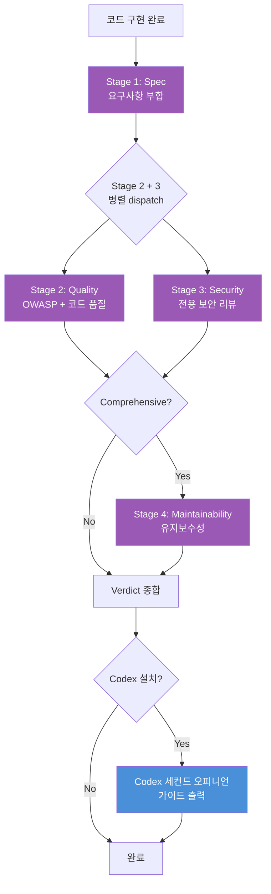

### 7.2 R-mode (다모델 편향 보완) — 4-stage와 직교

| 모드 | 동작 | 사용 조건 |
|------|------|----------|
| **R1** | Claude 단일 리뷰어 순차 dispatch | Minimal/Standard 기본 |
| **R2** | Council (Claude + Codex) | 사용자 명시 시 |
| **R3** | Agent Teams (다수 협업 리뷰) | Comprehensive + 고복잡 |
| **Ra** | 자동 — Distrust by Default 기본 동작 | Standard 이상 |

**핵심**: 4-stage(관점)와 R-mode(모델 다양성)는 직교 차원. R2/R3에서도 4-stage 관점은 유지.

### 7.3 12 리뷰어 프롬프트

| 프롬프트 | 용도 | 사용 스킬 |
|---------|------|----------|
| `spec-document-reviewer-prompt.md` | 설계 문서 | brainstorming |
| `plan-document-reviewer-prompt.md` | 구현 계획 | writing-plans |
| `artifact-reviewer-prompt.md` | INCEPTION 산출물 | application-design 게이트 |
| `spec-reviewer-prompt.md` | Spec compliance | requesting-code-review Stage 1 |
| `code-quality-reviewer-prompt.md` | 코드 품질 + OWASP | requesting-code-review Stage 2 |
| `security-reviewer-prompt.md` | 보안 리뷰 | requesting-code-review Stage 3 |
| `maintainability-reviewer-prompt.md` | 유지보수성 | requesting-code-review Stage 4 |
| `code-reviewer-prompt.md` | Spec + Quality 통합 | construction-orchestrator |
| `code-plan-reviewer-prompt.md` | 코드 계획 | code-generation PART 1 |
| `council-review-protocol.md` | Council/Teams 프로토콜 | requesting-code-review R2/R3 |
| `implementer-prompt.md` | 서브에이전트 구현자 | subagent-driven-development |
| `skill-reviewer-prompt.md` | 스킬 검증 | writing-skills REFACTOR |

### 7.4 타임아웃 정책

| 설정 | 기본값 | 비고 |
|------|--------|------|
| 개별 리뷰어 타임아웃 | 300초 | "타임아웃 600초로" 자유 발화로 세션별 조정 |
| R3 팀 전체 타임아웃 | 600초 | |
| 리뷰 루프 max retry | 5회 | 초과 시 사용자 escalate |

상세: `_shared/devflow-conventions.md` §리뷰 규약, `_shared/reviewers/council-review-protocol.md`

---

## 8. Auto Mode (옵트인, 분리 가능)

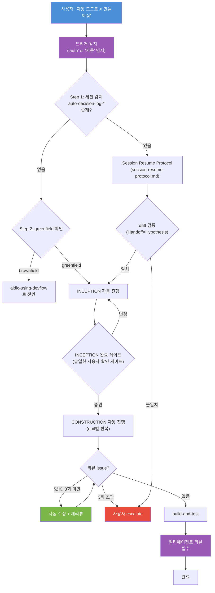

### 8.1 설계 원칙

- **단일 SKILL.md** (520줄) + 부속 파일 2개 (`decision-log-format.md`, `session-resume-protocol.md`).
- **greenfield 전용**, brownfield는 `aidlc-using-devflow`로 자동 폴백.
- **3회 자동 수정 후 escalate** (5회 → 3회 축소, 자율 모드는 빨리 escalate가 안전).
- **분리 비용 0**: 파일 1개 삭제 + plugin.json 1줄 제거.
- **유일한 사용자 게이트**: INCEPTION 완료 시 1회. Resume 시 추가 게이트는 drift/4a/4c.

### 8.2 외부 분리 패턴 (BL-105)

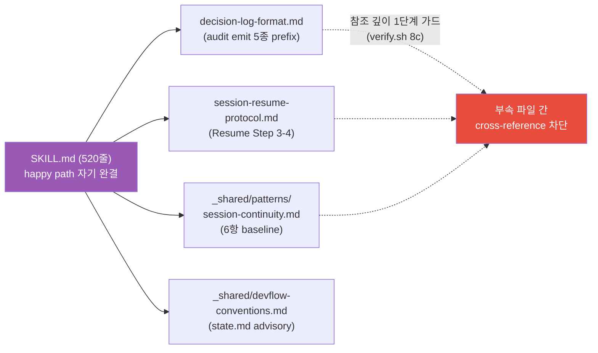

**규칙**:
- happy path는 SKILL.md 자기 완결.
- 비정상 경로(audit, Resume, 6항)는 baseline + 부속 파일 위임.
- 정합성 fix는 외부 분리로 처리 ("한도 무한 상향" 안티패턴 차단).
- **참조 깊이 1단계**: 부속 파일끼리 다시 cross-reference 금지 → `verify.sh` 8c가 정적 가드.

상세: `skills/aidlc-auto-mode/SKILL.md`, [`docs/guide/auto-mode-guide.md`](auto-mode-guide.md)

---

## 9. Knowledge System Phase 1 (v1.10.0+)

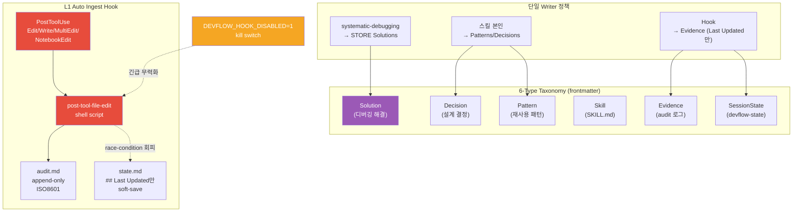

### 9.1 핵심 결정

| 결정 | 근거 |
|------|------|
| 6-type taxonomy만, 하위 타입 금지 | 분류 비대화 차단 |
| 새 최상위 디렉토리 없음 | 기존 `devflow-docs/`, `skills/` 구조 유지 |
| Solution layer **단일 writer** (`systematic-debugging`) | dead layer 방지 |
| Hook은 `## Last Updated`만 soft-save | race condition 회피 |
| `DEVFLOW_HOOK_DISABLED=1` kill switch | 긴급 무력화 (audit 급성장, 파손 등) |
| 5-level rollback guide 사전 작성 | 변경 회수 경로 보장 |

### 9.2 Hook 안전 설계

`hooks/post-tool-file-edit` 스크립트:
- **jq 우선, python3 fallback, 둘 다 없으면 loud fail** (silent skip 안 함).
- 경로 canonicalization (symlink/`..` 정규화).
- whitelist/exclusion (devflow-docs, .git 제외 등).
- 시크릿 패턴 자동 redaction (`.env*`, `credentials.*`, AWS keys 등).

상세: `docs/research/knowledgesystem/`, `_shared/devflow-conventions.md` §6-type

---

## 10. 메타 태그 시스템 + 3-Layer 정적 검증

오케스트레이터 SKILL.md에 HTML 주석 형태의 메타 태그가 삽입되어 있다. **LLM 토큰 0**으로 분기/라우팅/스텝 순서를 정적 검증.

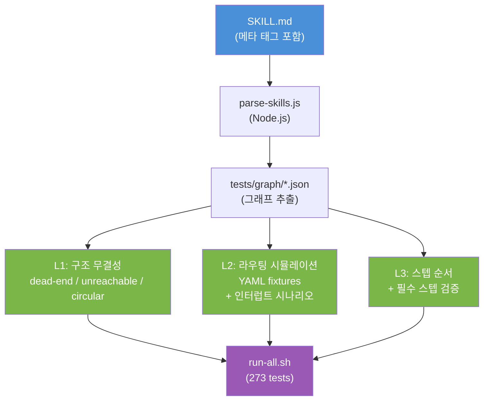

### 10.1 태그 타입

| 태그 | 용도 | 예시 |
|------|------|------|
| `@gate` | 분기점 선언 | `<!-- @gate: complexity-declaration -->` |
| `@gate-option` | 선택지 정의 | `<!-- @gate-option: A -> requirements-analysis -->` |
| `@step` | 실행 단계 순서 | `<!-- @step:1 id=workspace-detection -->` |
| `@condition` | 자동 분기 조건 | `<!-- @condition: complexity==Minimal -> workflow-planning -->` |
| `@interrupt` | 인터럽트 핸들러 | `<!-- @interrupt: global -->` |
| `@state-update` | 상태 갱신 시점 | `<!-- @state-update: stage 시작 → Current Stage 갱신 -->` |
| `@resume-rules` | 세션 재개 분기 | `<!-- @resume-rules -->` |
| `@audit-emit` | audit 로그 emit prefix | `<!-- @audit-emit: stage-completed | key=value -->` |

### 10.2 적용 범위 (v1.12.0)

| 스킬 | 메타 태그 수 |
|------|------------|
| `aidlc-inception-orchestrator` | 58 (8 steps, 12 gates, 5 conditions, 4 state-updates) |
| `aidlc-construction-orchestrator` | 24 (3 steps, 5 gates, 1 interrupt, 3 state-updates) |
| `aidlc-using-devflow` | 6 (resume-rules + 3 state-updates) |
| `aidlc-finishing-a-development-branch` | 3 state-updates (옵션 A/B/D) |
| `aidlc-auto-mode` | audit-emit 5 prefixes + Drift 가드 |
| `aidlc-systematic-debugging` | audit-emit 일관 prefix (BL-098) |

### 10.3 273 테스트 구성

| 카테고리 | 테스트 파일 | 검증 대상 |
|---------|-----------|---------|
| 메타 태그 | `test_meta_tag_format.py`, `test_parser_output.py` | 태그 형식 + 파서 출력 |
| L1 | `test_graph_validator.py` | dead-end / unreachable / circular |
| L2 | `test_routing_simulator.py`, `test_routing_engine.py` | YAML 시나리오 시뮬레이션 |
| L3 | `test_step_order.py` | 스텝 순서 + 필수 스텝 |
| K-gate | `test_construction_k_gate.py` | K-gate + 리뷰 게이트 |
| Verification | `test_verification_contract.py` | Verification Contract + Self-Healing |
| 정량 루브릭 | `test_quantitative_rubric.py` | 루브릭 점수 계산 |
| Solutions | `test_devflow_solutions.py` | Knowledge Compounding |
| Agent Teams | `test_agent_teams_review.py` | R3 협업 리뷰 |
| Memory Sync | `test_memory_sync_reconciliation.py` | auto-memory ↔ devflow-docs sync |
| Self-Review | `test_self_review_checklist.py` | INCEPTION 셀프리뷰 |
| Hook | `test_session_start_hook.py`, `verify-hook-behavioral.sh` | SessionStart + PostToolUse |

규격: `_shared/patterns/meta-tag-standard.md`

---

## 11. Hook 시스템

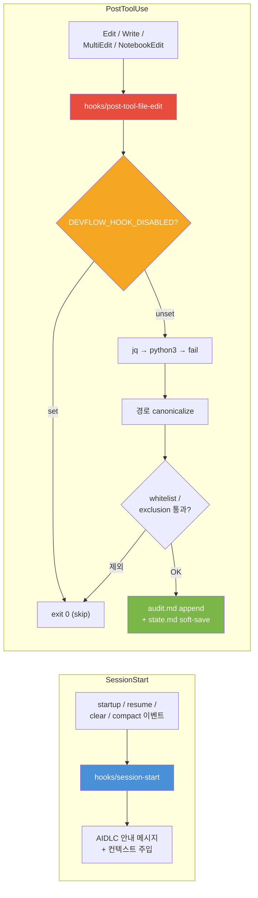

설정: `hooks/hooks.json`

---

## 12. 산출물 구조

```
devflow-docs/
├── inception/
│   ├── workspace.md            # 워크스페이스 분석 (cache, 아카이브 제외)
│   ├── requirements.md         # 요구사항 (해석 확정 포함)
│   ├── user-stories.md         # 사용자 스토리 (조건부)
│   ├── nfr-requirements.md     # 비기능 요구사항 (조건부)
│   ├── workflow-plan.md        # 승인된 실행 계획
│   ├── application-design.md   # 컴포넌트 설계 (조건부)
│   └── units.md                # 개발 단위 목록 (조건부)
├── construction/
│   ├── {unit}/
│   │   ├── functional-design.md  # Comprehensive 한정
│   │   └── code-plan.md          # Plan + 진행 체크박스
│   └── build-and-test/
│       ├── build-instructions.md
│       └── test-instructions.md
├── backlog.md                   # 백로그 (Next/Open/Someday)
├── session-summary.md           # 세션 요약 (6항 작성 규칙 + Traps)
├── devflow-state.md             # 현재 상태 (advisory cache, @resume-rules 참조)
├── audit.md                     # append-only 로그 (ISO8601)
├── auto-decision-log-inception.md      # auto-mode 자율 판단 (INCEPTION)
└── auto-decision-log-construction.md   # auto-mode 자율 판단 (CONSTRUCTION)
```

### 12.1 파일 책임 분담

| 파일 | Writer | Reader | 비고 |
|------|--------|--------|------|
| `inception/*.md`, `construction/*.md` | 각 stage skill | orchestrator + 다음 stage | 강제 생성 |
| `audit.md` | post-tool-file-edit hook + skill emit | 사람 / 사후 분석 | append-only |
| `devflow-state.md` (구조) | skill (using-devflow, auto-mode 등) | orchestrator @resume-rules | advisory cache |
| `devflow-state.md` (`## Last Updated`) | hook (soft-save) | (timestamp drift 수용) | race-free |
| `session-summary.md` | stage skill (조기 업데이트 + 게이트 승인 후) | 다음 세션 (검증 대상) | Handoff = Hypothesis |
| `auto-decision-log-*.md` | aidlc-auto-mode | aidlc-auto-mode (재개) | 5종 prefix |

---

## 13. 디렉토리 구조 (v1.12.0)

```
skills/
├── aidlc-using-devflow/             ← Entry Orchestrator
├── aidlc-inception-orchestrator/    ← Phase Orchestrator
├── aidlc-construction-orchestrator/
├── aidlc-auto-mode/                 ← 옵트인 (외부 분리: 3 files)
│   ├── SKILL.md (520줄)
│   ├── decision-log-format.md
│   ├── session-resume-protocol.md
│   └── verify.sh                    ← 8 검증 카테고리 (8a/8b/8c 외부 분리 무결성)
├── aidlc-*/                         ← 25 stage/quality skills
├── _shared/
│   ├── devflow-conventions.md       ← 전체 규약
│   ├── gate-patterns.md             ← 게이트 패턴 (인터럽트 포함)
│   ├── tdd-protocol.md              ← TDD Iron Law + Self-Review
│   ├── import-review-protocol.md    ← Import/Generate 프로토콜
│   ├── patterns/                    ← 공유 패턴 (17개)
│   │   ├── session-continuity.md    ← 6항 baseline + Traps + advisory
│   │   ├── interrupt-handler.md
│   │   ├── meta-tag-standard.md
│   │   ├── skill-{writing-guide,design-patterns,pattern-catalog}.md
│   │   ├── persuasion-principles.md
│   │   ├── tech-stack-{defaults,catalog}.md
│   │   ├── review-{gate-pattern,team-protocol,feedback-schema}.md
│   │   ├── council-cli-detection.md
│   │   └── ...
│   └── reviewers/                   ← 12 reviewer prompts
└── _utils/
    ├── devflow-state/               ← 상태 utility
    ├── devflow-audit/               ← 감사 로그
    └── devflow-solutions/           ← Knowledge Compounding 캐시

hooks/
├── hooks.json                       ← SessionStart + PostToolUse
├── session-start                    ← 안내 메시지 + 컨텍스트 주입
└── post-tool-file-edit              ← L1 auto ingest (race-free)

tests/
├── run-all.sh                       ← 273 tests
├── parse-skills.js                  ← 메타 태그 파서 (Node.js)
├── routing_engine.py                ← L2 시뮬레이터 (Python)
├── conftest.py                      ← pytest fixtures
├── graph/                           ← 파서 출력 JSON
├── scenarios/                       ← L2 YAML 시나리오 (인터럽트 포함)
├── eval-scenarios/                  ← Layer 2 행동 eval (auto-mode 3건)
├── test_*.py                        ← L1/L2/L3 + 기능별 검증 14개
├── verify-change-{1..6}.sh          ← Knowledge System Phase 1 검증
└── verify-hook-behavioral.sh        ← Hook 동작 검증

docs/
├── guide/                           ← 사용자/운영자/아키텍처 가이드
│   ├── how-it-works.md              ← 비기술 청중용
│   ├── user-guide.md                ← 사용법
│   ├── operator-guide.md            ← 커스터마이즈
│   ├── auto-mode-guide.md           ← Auto Mode 사용법
│   ├── memory-templates.md          ← best practice 위임 reference
│   ├── architecture.md → v2.md      ← 본 문서
│   ├── architecture_v1.md           ← 이전 버전
│   └── skill-design-patterns/       ← 외부 공개 가이드
├── analysis/                        ← 비교 분석
├── plans/                           ← 설계+구현 계획
└── research/                        ← 리서치 문서 (Knowledge System, Council 등)
```

---

## 14. Instruction Priority (충돌 해소)

```
1. 사용자 지시       (CLAUDE.md, 직접 요청)            ← 최우선
   ↓
2. 스킬 규칙         (SKILL.md, _shared/ 규약)
   ↓
3. 기본 동작         (시스템 프롬프트)                 ← 최하위
```

**적용**: 사용자가 "리뷰 스킵해" 명시 시, 스킬의 "Distrust by Default"보다 우선. 단, audit에 명시 SKIP 기록.

---

## 15. 스킬 패턴 7종 (행동) × 5종 (구조) — 직교

### 15.1 행동 패턴 7종

| 패턴 | 핵심 | 대표 스킬 |
|------|------|----------|
| **Iron Law** | "NO X WITHOUT Y" 강제 | test-driven-development |
| **Gate** | N지선다 분기 | finishing-a-development-branch |
| **Review Loop** | 산출물 → 리뷰 → 수정 반복 | code-generation |
| **Three-Mode** | Minimal/Standard/Comprehensive | requirements-analysis |
| **Hold/Skip** | Import/Generate + 보류 | nfr-requirements |
| **Orchestrator-Only** | 순수 실행자 | workspace-detection |
| **User-Invocable** | standalone + orchestrator 양용 | brainstorming |

### 15.2 구조 패턴 5종

| 패턴 | 핵심 | 대표 스킬 |
|------|------|----------|
| **Pipeline** | 단계간 게이트 선언 | systematic-debugging, receiving-code-review |
| **Decision Tree** | 분기 → 라우팅 | inception-orchestrator |
| **Iterative Refinement** | 산출물 반복 개선 | brainstorming |
| **Template Method** | 공통 골격 + 변형점 | application-design (LIST/DETAIL) |
| **Composite** | 다른 스킬 합성 | requesting-code-review |

상세: `_shared/patterns/skill-pattern-catalog.md`, `_shared/patterns/skill-design-patterns.md`

---

## 16. 서브에이전트 컨텍스트 격리

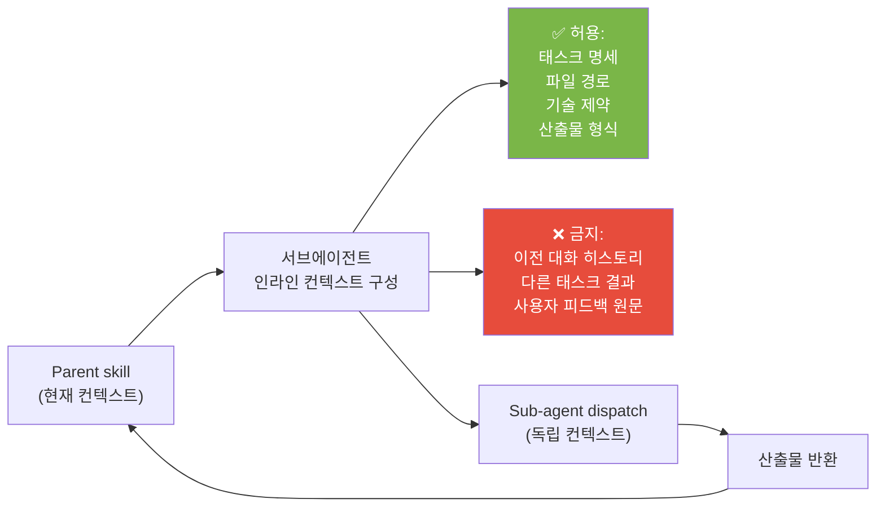

**근거**: 세션 히스토리 통째로 넘기면 토큰 낭비 + 혼선. 태스크 격리는 토큰 효율 + 결과 정확성 양쪽에서 ROI.

상세: `_shared/devflow-conventions.md` §컨텍스트 격리

---

## 17. 스킬 개발 풀사이클

writing-skills의 REFACTOR 단계 완료 후:

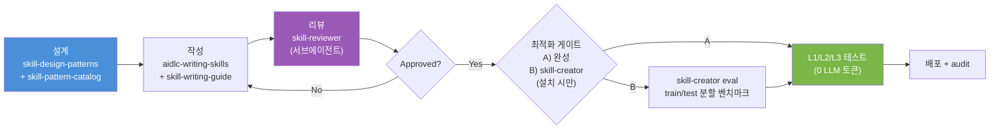

| 단계 | 도구 |
|------|------|
| 설계 | `skill-pattern-catalog` (행동 7종) + `skill-design-patterns` (구조 5종) |
| 작성 | `aidlc-writing-skills` + `skill-writing-guide` + `persuasion-principles` |
| 리뷰 | `skill-reviewer` 서브에이전트 |
| 최적화 | `skill-creator` 통합 게이트 (선택) |
| 테스트 | 3-Layer 정적 검증 (273 tests) |
| 운영 | `consistency-checklist` + 영향도 분석 규약 |

---

## 18. v1 대비 주요 변경 (Cheatsheet)

| 영역 | v1 | v2 |
|------|----|----|
| 스킬 수 | 27 | 28 + 3 utils (auto-mode 추가) |
| Hook | SessionStart 1개 | SessionStart + PostToolUse 2개 |
| 테스트 | 95 (Phase 2) | 273 |
| 게이트 | 6 패턴 | 6 패턴 + **3등급 분류** (자동/경량/정식) |
| 리뷰 | 4-stage 단일축 | 4-stage × R-mode (R1/R2/R3/Ra) **직교** |
| 외부 AI | Codex + Gemini | Codex 단일 (Gemini 운영 중단) |
| Brownfield | 분석 강화 | + **Stub Scan/잔존 검증** |
| Knowledge System | (미정) | **6-type taxonomy + L1 ingest hook** |
| Auto Mode | (없음) | **단일 SKILL.md + 외부 분리 패턴** |
| Handoff | session-summary 존재 | **6항 작성 규칙 + Handoff=Hypothesis + Traps** |
| state.md | 권위적 SSoT | **advisory cache** (derive from git log) |
| Mid-cycle pause | 5단계 | **2단계 자동화** (정보 분해 압축) |
| 외부 분리 | (없음) | **참조 깊이 1단계 가드** (verify.sh 8c) |
| Repo 분리 | (없음) | deployment-prep → **devflow-k8s-deploy** 졸업 |

---

## 19. 더 깊이 읽을 자료

| 문서 | 무엇을 다루는가 |
|------|---------------|
| [`README.md`](../../README.md) | 전체 기능/구조/스킬 목록 |
| [`docs/guide/how-it-works.md`](how-it-works.md) | 비기술 청중용 흐름 설명 |
| [`docs/guide/user-guide.md`](user-guide.md) | 사용법 |
| [`docs/guide/operator-guide.md`](operator-guide.md) | 커스터마이즈 |
| [`docs/guide/auto-mode-guide.md`](auto-mode-guide.md) | Auto Mode 사용법 |
| [`docs/guide/memory-templates.md`](memory-templates.md) | mid-cycle pause / 세션 종료 패턴 |
| [`docs/guide/architecture_v1.md`](architecture_v1.md) | 이전 아키텍처 (v1.7 이전) |
| [`docs/research/2026-05-06-aidlc-evolution-workshop.md`](../research/2026-05-06-aidlc-evolution-workshop.md) | 7주 진화 타임라인 14 phase |
| [`docs/research/2026-05-06-for-harness-builders.md`](../research/2026-05-06-for-harness-builders.md) | 하네스 빌더 대상 소개 |
| [`docs/analysis/2026-04-24-handoff-strategy-comparison.md`](../analysis/2026-04-24-handoff-strategy-comparison.md) | Handoff 전략 4-Layer 비교 |
| [`docs/research/knowledgesystem/`](../research/knowledgesystem/) | Knowledge System Phase 1 baseline + rollback |
| `_shared/devflow-conventions.md` | 모든 규약의 SSoT |
| `_shared/patterns/meta-tag-standard.md` | 메타 태그 규격 |
