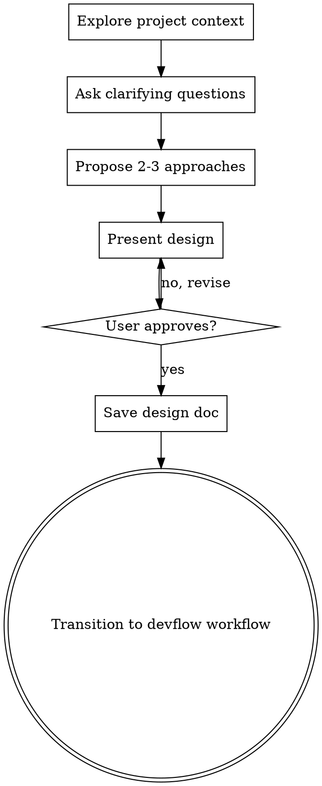

# Brainstorming

<!-- 아이디어를 설계로 전환: 구현 전 반드시 거치는 협업적 설계 프로세스 -->
<!-- HARD GATE: 설계 승인 없이 코드 작성 절대 금지 -->

## Overview

Help turn ideas into fully formed designs through collaborative dialogue.

**Core principle:** Understand before designing. Design before implementing.

<HARD-GATE>
Do NOT write any code, scaffold any project, or take any implementation action until you have presented a design and the user has approved it. This applies regardless of perceived simplicity.
</HARD-GATE>

## Anti-Pattern: "This Is Too Simple To Need A Design"

Every feature goes through this process. Simple things become complex through unexamined assumptions. The design can be short — but you MUST present it and get approval.

## The Process



## Step 1: Explore Project Context

Before asking anything, check:
- Existing files, `devflow-docs/`, recent commits
- `devflow-docs/inception/workspace.md` if it exists
- Key build files (`package.json`, `pyproject.toml`, `go.mod`, etc.)

## Step 2: Ask Clarifying Questions

**Rules:**
- One question at a time — never multiple at once
- Prefer multiple-choice over open-ended
- Focus on: purpose, constraints, success criteria, edge cases

**Stop when you understand:**
- What the user wants to achieve (not just what they asked for)
- Key constraints (tech stack, compatibility, performance)
- What "done" looks like

## Step 3: Propose 2-3 Approaches

Present options with trade-offs. Lead with your recommendation:

```
## 접근 방식

**A) [권장] [Approach Name]**
- 방법: [brief description]
- 장점: [benefits]
- 단점: [drawbacks]

**B) [Approach Name]**
- 방법: [brief description]
- 장점: [benefits]
- 단점: [drawbacks]

권장: A안 — [one sentence why]
```

## Step 4: Present Design

Once approach is selected, present the design in sections. Ask after each section:

**Sections to cover** (scale depth to complexity):
- **Architecture**: Overall structure, key components
- **Data Flow**: How data moves through the system
- **Interfaces**: Public APIs, data schemas
- **Error Handling**: Failure modes and recovery
- **Testing Strategy**: What to test and how

After each section:
```
이 섹션이 맞는 방향인가요?
A) 수정 요청
B) 계속 진행
```

## Step 5: Save Design Document

Save approved design to `docs/plans/YYYY-MM-DD-<topic>-design.md`.

Format:
```markdown
# [Feature Name] Design

**Date**: YYYY-MM-DD
**Approach**: [chosen approach]

## Architecture
[content]

## Data Flow
[content]

## Interfaces
[content]

## Error Handling
[content]

## Testing Strategy
[content]

## Open Questions
[any unresolved items]
```

## Step 6: Transition to devflow Workflow

After design is saved:

```
설계 문서가 저장되었습니다: docs/plans/YYYY-MM-DD-<topic>-design.md

다음 단계:
A) using-devflow 로 AI-DLC 워크플로우 시작 (requirements-analysis → workflow-planning → code-generation)
B) writing-plans 로 구현 계획 바로 작성
```

**If A):** The design becomes input to `requirements-analysis`. devflow-state will track progress.
**If B):** Use `writing-plans` skill to create task-by-task implementation plan.

## Key Principles

- **YAGNI ruthlessly** — Remove unnecessary features from all designs
- **One question at a time** — Don't overwhelm with multiple questions
- **Multiple choice preferred** — Easier to answer than open-ended
- **Incremental validation** — Present design, get approval section by section
- **No code before approval** — Hard gate, no exceptions

## devflow Integration

When devflow workflow is active:
- Save design to `devflow-docs/inception/` as well as `docs/plans/`
- Log brainstorming completion to devflow-audit
- Approved design feeds into `requirements-analysis` stage
